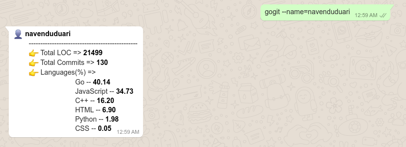
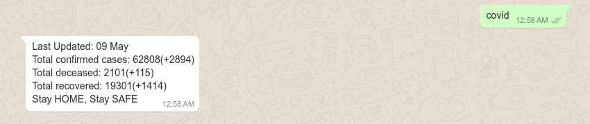

# **goinfo** gives experience of CLI through WhatsApp 
Basic application for programmed WhatsApp communication

## Example

## Run
* Step 1: Save the number **"+14155238886"** with any name of your choice
* Step 2: Send **"join dozen-forty"** to the number on WhatsApp
* Step 3: Send any random message to the number on WhatsApp
* Step 4: Do as directed

## TODO
* Wrong command handle